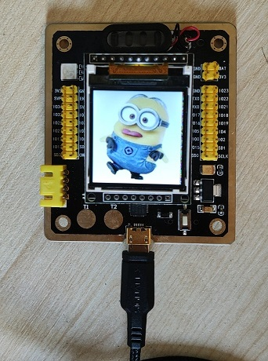

## ESP32 ST7735 Remote Display

This project displays images remotely on ESP32 with ST7735 TFT Screen using Micropython.


### Quick Start

0. Change the WIFI and GPIO settings in `esp32_server.py`

1. Upload `esp32_server.py` to your ESP32 and rename it as `boot.py` (Thonny IDE)


2. On your PC:

```
python pc_client.py --ip 192.168.199.142 --port 9191
```

By default, this displays minions.jpg on the ESP32 board remotely **using Wifi**.


